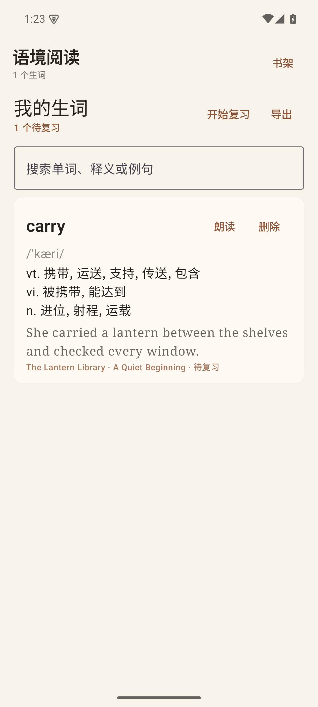
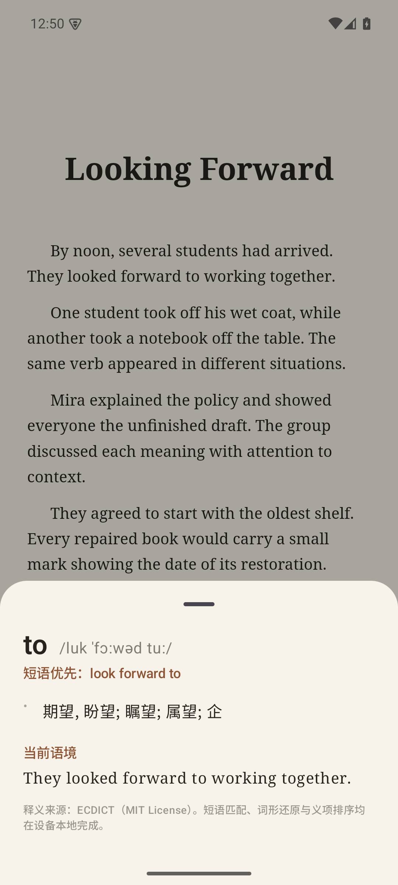
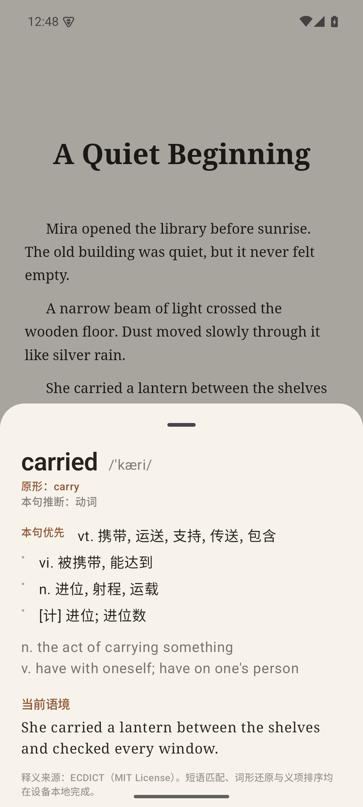
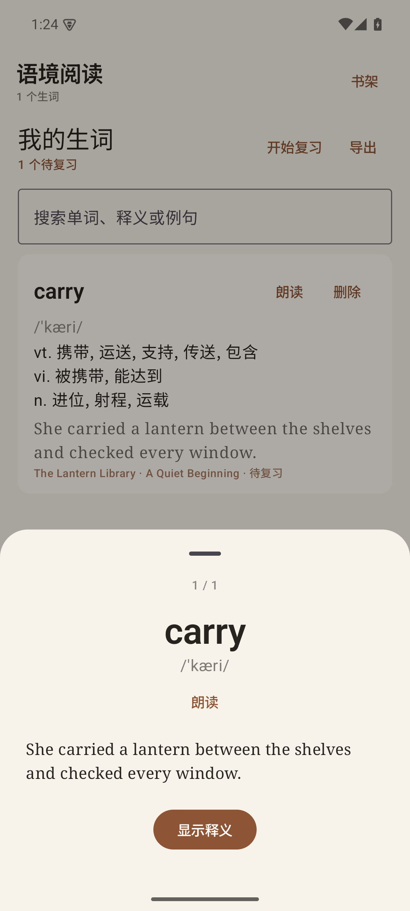
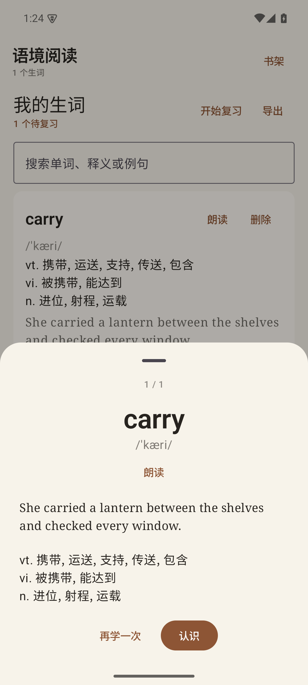

# LinguaReader / 语境阅读

一个面向中文母语学习者的 Android 英文阅读器原型。用户可以导入无 DRM 的 EPUB、TXT、FB2 或带文字层的 PDF，在分页阅读时点击单词查看离线英汉释义和当前句。

可直接安装的调试 APK 请从 [Releases 页面](https://github.com/xyu20071224-design/reader/releases) 下载，配套测试电子书为 [测试电子书-TheLanternLibrary.epub](测试电子书-TheLanternLibrary.epub)。完整验证结果见 [VALIDATION.md](VALIDATION.md)。

## 界面预览







## 已完成功能

- 使用 Android 系统文件选择器导入 EPUB、TXT、FB2 与文字版 PDF
- 解析 EPUB container、OPF、manifest、spine、封面和章节；PDF 提取文字层并按书签/标题/页块分章
- 书架、封面、作者、阅读进度和本地图书移除
- 横向分页阅读及章节前后跳转
- 目录、字号、行距、字体、明亮/护眼/夜间主题
- 保存章节、页码和总阅读进度
- 点击正文单词并提取当前句
- 内置 ECDICT 离线英汉词典
- 66,630 条离线词形关系，支持常见及不规则词形还原
- 识别包含点击位置的 2–5 词短语；仅短语语义核心（首个实义词或紧随动词的小品词）触发词组优先，其余情况回退单词释义并提供相关短语入口
- 根据本句结构推断词性，并把相符的中文义项置顶
- 支持英文缩写、连字符词和所有格
- 256 项内存查询缓存；查词、短语和排序过程均无需联网
- 可选的 AI 语境翻译（增强）：首次阅读时按章节生成本书语境档案（角色译名、术语、文体、摘要），点词时结合当前句给出本书专属释义；默认关闭，需用户自行启用并填写 DeepSeek API Key
- 不填 Key 或 DeepSeek 请求失败/超时时自动降级为本地轻量语境档案：基于词频离线提取本书反复出现的专名/术语并给出出现位置提示，全程不联网
- 每本书独立术语表：AI 自动导入角色/地点/术语，可在书级入口手动增删改；支持“保留原文不译”和按条目开关，手动条目优先于自动条目
- 可选的整句翻译：提供方抽象为 `SentenceTranslator`，Azure AI Translator 优先（术语以动态词典标记随请求生效），未配置 Azure 时自动用 DeepSeek 兜底；均严格遵循本书术语表
- 系统英文语音朗读
- 听书：整章/全书连续朗读（系统 TTS，中英支持），打开听书不自动播放，首次点击正文任意单词/句子即从该句开始；朗读时当前句高亮重新定位（不强制翻页）
- 听书支持暂停/继续、上一句/下一句、0.5×–2.0× 语速调节、后台播放与通知栏/锁屏媒体控制，并自动记住每本书的收听进度
- 可选外置 TTS：系统语音 / Azure 云 TTS（世纪互联中国区）/ 火山引擎（豆包语音）/ 自建 OpenAI 兼容服务器（Fish Speech S2、GPT-SoVITS 等）；整章首次预生成并缓存，失败自动回退系统语音
- 生词收藏，保存中文释义、来源书籍、章节与完整例句；有 AI 语境释义时一并保存并在生词本/复习卡展示
- 生词本全文搜索、删除和 CSV 导出
- “显示释义 → 认识/再学一次”的间隔复习流程
- 12 小时/1/2/4/7/15/30 天间隔复习，可按“沉浸/温和/勤学”预设或自定义节奏（记忆曲线取点）缩放（新词按节奏首次延迟到期）
- EPUB 解压路径穿越、条目数和总体积防护
- 删除书内脚本及 HTML 事件属性，阻止远程资源请求
- 启动问候：按早/中/晚显示问候语
- 版本更新说明：每次更新后首次启动弹出一次
- 默认不联网；仅当用户显式启用 AI 语境翻译（DeepSeek）、Azure 整句翻译或云 TTS 时，相应文本才会发送到对应服务，其余图书、词典、生词与复习记录均留在设备

## 技术栈

- Kotlin
- Jetpack Compose + Material 3
- Android WebView
- Jsoup
- PDFBox Android（文字版 PDF 文本提取）
- SQLite（只读离线词典）

## Windows 桌面版（迁移中）

新增跨平台工程 [desktop/](desktop/README.md)：同一 `composeApp` 模块同时构建 Android 与 Windows 桌面版，桌面阅读渲染采用 JavaFX WebView，首版不包含听书与定时提醒。构建、数据目录与验证方式见 [desktop/README.md](desktop/README.md)。

## 构建

需要 JDK 17 和 Android SDK 35。

```bash
./gradlew assembleDebug
```

安装到已连接的模拟器或设备：

```bash
./gradlew installDebug
```

运行单元测试和 Android 仪器测试：

```bash
./gradlew testDebugUnitTest
./gradlew connectedDebugAndroidTest
```

## 阅读手势

- 正文中部点击英文单词：显示释义
- 页面左右 13% 区域点击：前后翻页
- 左右快速滑动翻页：左滑下一页、右滑上一页
- 上下快速滑动翻页：上滑下一页、下滑上一页
- 慢速上下拖动：进入卷轴模式连续滚动，进入后保持，底部显示章节进度；点“分页”恢复整页翻页
- 底部箭头：前后翻页
- 底部页码指示：点击后输入页码，在本章内跳转
- 点击正文空白：显示或隐藏工具栏
- 顶部“目录”：选择章节
- 顶部“Aa”：调整阅读外观
- 阅读设置 → “听书设置”：切换朗读引擎，配置 Azure Region/Key 与音色、火山引擎 API Key（或 App ID+Token）/Resource ID/中英文音色，或配置自建服务器地址/模型/Token/音色，并可测试连接
- 释义卡“朗读”：使用 Android 系统英语语音
- 顶部“听书”：打开听书进入待选起点状态（不自动播放），点击正文单词/句子后从该句开始朗读
- 听书播放条：上一句、播放/暂停、下一句、起点（其后第一次正文点击设置起始点）、语速、停止
- 听书时点击正文句子：从此句开始朗读（停止听书后恢复为点词查词）
- 释义卡“加入生词本”：保存当前义项与例句
- 书架“生词本”：搜索、复习或导出收藏内容
- 已收藏词再次出现时以细点下划线标记，点击后可直接进入复习
- 复习提醒入口：工具栏到期角标、翻章/返回书架停顿点提示、查词面板“复习”按钮
- 三套复习节奏预设 + 自定义节奏（记忆曲线取点，可调首次复习与提醒）
- 提醒方式独立开关：语境浮现 / 停顿点提示 / 工具栏角标 / 定时轻提醒（Android 13+ 权限，拒绝时静默降级）/ 仅手动

## 当前范围

当前版本已经形成“导入图书 → 点击语境查词 → 收藏例句 → 间隔复习 → CSV 导出”的完整本地学习闭环，支持无 DRM、可重排版的 EPUB、TXT、FB2 与带文字层的 PDF；扫描版/图片型 PDF（需 OCR）、MOBI/AZW3、DRM 和云同步属于其他产品范围。语境排序默认采用可解释的本地规则；用户可选用 DeepSeek API 生成书级语境档案作为增强，未启用时所有处理仍在设备本地完成。

## 第三方数据

离线释义来自 [ECDICT](https://github.com/skywind3000/ECDICT)，按其 MIT License 使用，完整许可见 `src/app/src/main/assets/dictionary/LICENSE-ECDICT.txt`。

## 许可证

应用代码采用 MIT License，见 [LICENSE](LICENSE)。离线词典数据来自 ECDICT（MIT License），许可见 `src/app/src/main/assets/dictionary/LICENSE-ECDICT.txt`。
